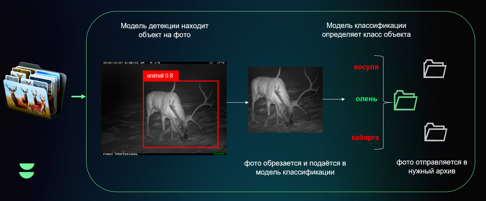
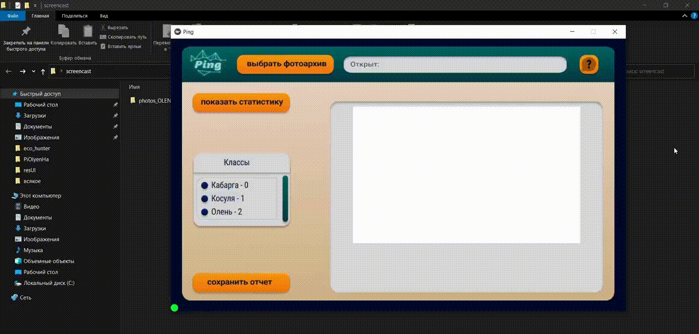

  </a>

## 
Стэк технологий📑

  
  
  
   
  
  

## 
О нашем решении📝

Наше решение данного кейса является десктопным приложением, классифицирующим три вида животных: Кабаргу, Благородного оленя, Косулю.
Это приложение должно повысить удобство и скорость обработки изображений, получаемых с автоматических фотоловушек, работая в автономном режиме на PC оператора, без доступа в интернет. 

## 
Быстрый старт🎢

####  Запуск приложения

  Вам необходимо: 
  &ensp; 1. Установить Python версии не меньше 3.9 
  &ensp; 2. В папку по пути modules/models скачать и поллжить веса с ссылки https://drive.google.com/drive/u/1/folders/1EvYpENmxXWTXIo0z2yulSk0G8F92pU2G 
  &ensp; 3. В cmd "pip install -r requirements.txt" 
  &ensp; 4. Запустить PingApp.py 

#### Как это работает?

  После запуска приложения, пользователь видит понятный и интуитивынй итерфейс. Сценарий использования приложения такой: 
  &ensp; 1. Запустив приложение пользователь нажимает на кнопку "Выбрать фотоархив", в открывшемся проводнике он выбирает архив или папку с собранными данными и нажимает "Сохранить". 
  &ensp; 2. После выбора директории фотографий с фотографиями, пользователь нажимает кнопку "Сканировать фотографии". 
  &ensp; 3. Далее немного подождав (все зависит от объема данных), в центре экрана приложения отображается статистика по обработанному фотосету. 
  &ensp; 4. Затем у пользователя есть возможность сохранить результаты обработки фотографии моделью, с помощью кнопки "Сохранить отчет".

 
 

## 
Детекция и классификация📸

  Данное решение содержит два типа сетей: детектор и классификаторы.
  В качестве детектора ипользуется бесклассовая модель Yolov8n.
  В качестве классификаторов используется ансамбль ResNet50xt.

  #### Схема работы приложения
  

    </a>
  

  <!---->

## 
Результат работы моделей🔮

  Качество работы моделей на основании обучающего набора данных: 
  &ensp; Детектор:  
  F1-score - 89% 
  Точность - 94% 
  &ensp; Классификатор:  
  F1-score - 95% 
  Точность - 95% 

## 
Демонстрация работы🎞

  ГИФКА

  </a>

